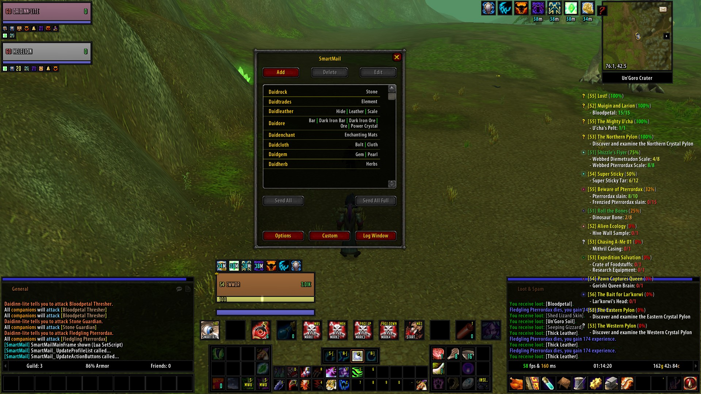
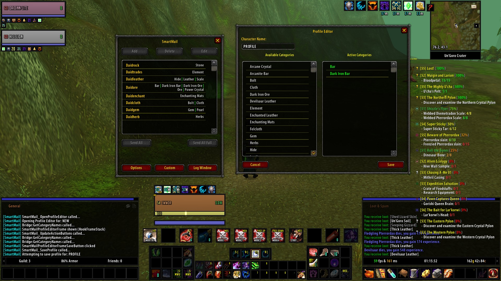
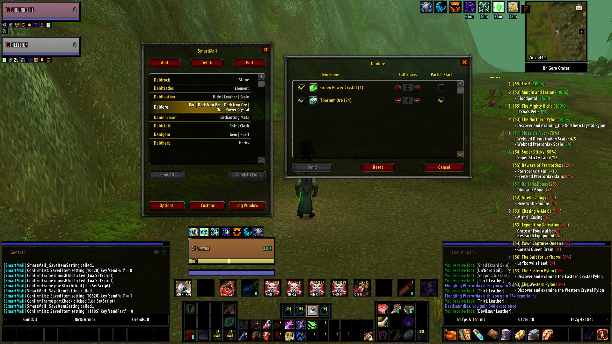
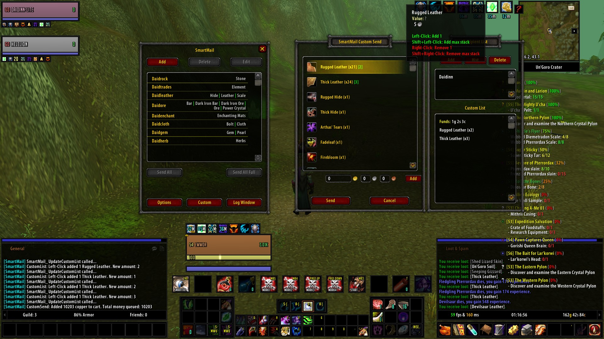

# SmartMail (v1.0)
A smart, automated mailing assistant for World of Warcraft (Vanilla 1.12.1).

SmartMail takes the headache out of inventory management by automatically sorting and mailing your items to the correct characters based on customized categories. Stop dragging items manually—just configure your profiles and let SmartMail handle the rest!

## 🌟 Features
* **Automated Category Matching**: Map specific items (e.g., Cloth, Herbs, Ore) directly to your bank alts.
* **Dual-Pane Profile Editor**: A clean, intuitive interface for assigning categories to specific characters.
* **Granular Stack Controls**: Set exactly how many full stacks to send, or click the checkbox to include partial stacks.
* **Mass Send ("Send All")**: Mail every matching item to *every* profile you have set up with a single click.
* **"Send All Full" Mode**: A specialized mass-send that *only* mails complete stacks, leaving your partial stacks in your bags so you can keep farming.
* **Custom Send**: A quick override window to manually send items to any saved character without needing a matching category.

---

## 📸 How It Works (Visual Guide)

### 1. The Main Hub
Open your mailbox and type `/sm` to open the SmartMail interface. This is your command center showing all your saved profiles and their assigned item categories. From here, you can trigger a massive **Send All** or **Send All Full** across every character at once.

### 2. Create a Profile
Click **Add** to create a new profile. In the **Profile Editor**, you'll see a dual-pane layout. Left-click a category on the left to assign it to that character, and right-click on the right to remove it.

### 3. Per-Category Sending & Stack Controls
Click on any profile in your main list to open the **Confirm Window**. Here you can see exactly what is about to be mailed to that specific character. 
* Use the **+/-** buttons or type a number to specify how many **Full Stacks** to send (or set it to `MAX`).
* Check the box on the far right to include any **Partial Stacks**. 

### 4. Custom Sends
Just need to do a quick manual transfer? Click the **Custom** button on the main window. You can pick any of your saved recipients and mail items directly without worrying about category rules.

---

## ⚙️ Installation
1. Download the latest release.
2. Extract the `SmartMail` folder.
3. Place it into your WoW AddOns directory: `World of Warcraft/Interface/AddOns/SmartMail`.
4. Boot up the game and ensure "Load out of date AddOns" is checked.

## ⌨️ Commands
* `/sm` — Opens the main interface.
* `/sm tutorial` — Replays the in-game tutorial frame.
* `/sm debug on` — Enables verbose chat logging for troubleshooting.
* `/sm debug off` — Disables verbose logging.

## 🚀 Future Roadmap
* **Stress 2.0**: A full stress-testing suite targeted at vMaNGOS / cMaNGOS environments for extreme high-volume barrage testing and adaptive latency tuning.
